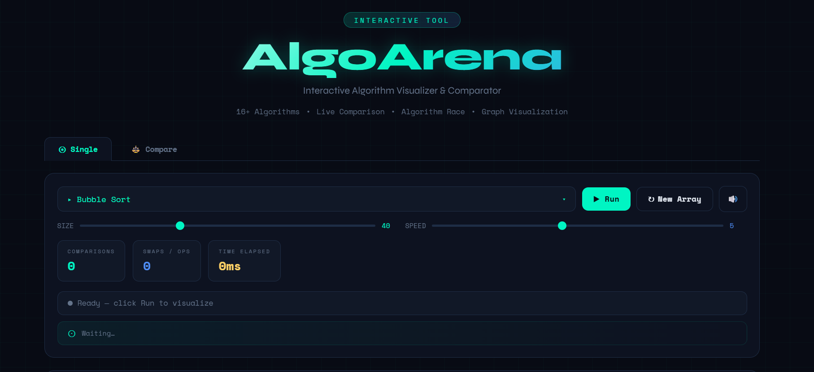
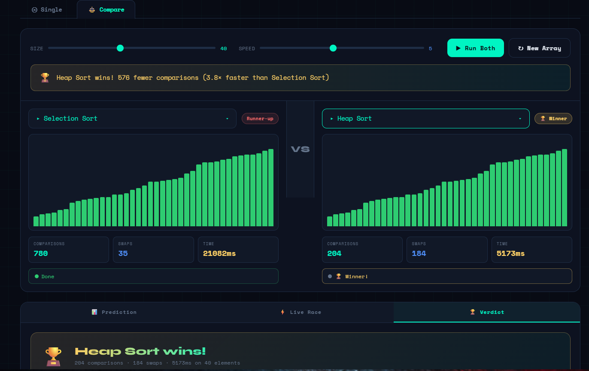
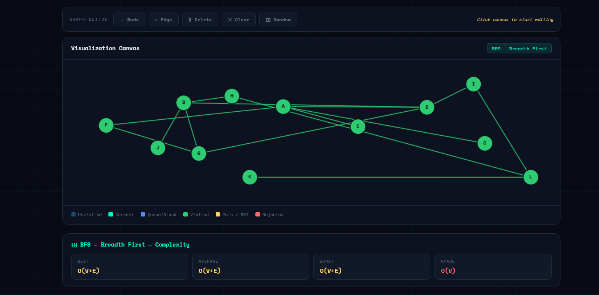

# ⚡ AlgoArena
### Interactive Algorithm Visualizer & Comparator

AlgoArena is a modern web-based algorithm visualizer that helps users understand how algorithms work through interactive animations and real-time comparisons.

---

# 🚀 Live Demo

Hosted using GitHub Pages

https://souravlabx.github.io/AlgoArena

---

# 📸 Project Preview

### Algorithm Visualizer

### Algorithm Comparison Mode

### Graph Algorithms

---

# ✨ Features

- Interactive algorithm visualization
- 16+ algorithms implemented
- Live algorithm comparison system
- Adjustable array size
- Adjustable animation speed
- Graph algorithm visualization
- Modern animated UI
- Educational algorithm explanation system

### Real-time statistics

- Comparisons
- Swaps
- Execution time

---

# 🧠 Algorithms Implemented

## Sorting Algorithms

- Bubble Sort
- Selection Sort
- Insertion Sort
- Merge Sort
- Quick Sort
- Heap Sort

## Searching Algorithms

- Linear Search
- Binary Search

## Graph Algorithms

- Breadth First Search (BFS)
- Depth First Search (DFS)
- Dijkstra's Algorithm
- Minimum Spanning Tree

---

# ⚔️ Compare Mode

AlgoArena includes a live comparison system where two algorithms run simultaneously.

Users can compare:

- Execution time
- Number of comparisons
- Number of swaps
- Overall algorithm efficiency

This helps visually demonstrate time complexity differences between algorithms.

---

# 🎛 User Controls

- Algorithm selector
- Array size slider
- Speed controller
- Run / Reset buttons
- Sound toggle
- Compare mode switch

---

# 🛠 Tech Stack

- HTML5
- CSS3
- JavaScript 

No external frameworks are used — everything is implemented from scratch.

---

# 🎯 Purpose of the Project

This project was built to:

- Improve understanding of Data Structures & Algorithms
- Provide an interactive learning tool
- Visualize algorithm behavior step-by-step
- Demonstrate algorithm performance and complexity
- Practice frontend development using JavaScript

---

# 👨‍💻 Author

Sourav Ray  

GitHub  
https://github.com/souravlabx

---

# ⭐ Support

If you found this project useful, consider giving it a ⭐ on GitHub.

